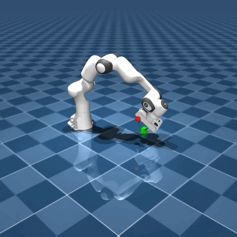

# Panda Pick-and-Place – Reinforcement Learning

A reinforcement learning project that trains a Franka Emika Panda robot arm to pick up an object and place it at a target location, using MuJoCo for physics simulation and Stable-Baselines3 for RL algorithms.

<p align="center">
  
</p>

## Setup

```bash
pip install gymnasium mujoco stable-baselines3 imageio moviepy numpy
```

## Training

```bash
# Train with SAC (default)
python train.py --algo SAC --timesteps 500000

# Train with TD3
python train.py --algo TD3 --timesteps 500000

# See all options
python train.py --help
```

Supported algorithms: **SAC**, **TD3**, **DDPG**, **PPO**

Monitor training progress with TensorBoard:

```bash
tensorboard --logdir tensorboard_logs
```

## Evaluation

```bash
# Evaluate with live MuJoCo viewer
python evaluate.py --model models/SAC_dense_20260315_143548/best_model.zip --render --episodes 5

# Evaluate and record video
python evaluate.py --model models/SAC_dense_20260315_143548/best_model.zip --record-video --episodes 3

# See all options
python evaluate.py --help
```

## Environment

- **Observation** (48-dim): joint positions/velocities, gripper state, object pose, relative distances, contact flags
- **Action** (4-dim): end-effector Cartesian velocity (dx, dy, dz) + gripper open/close
- **Reward**: dense (shaped) or sparse (binary success)
- **Success**: object placed within 5 cm of the target position
